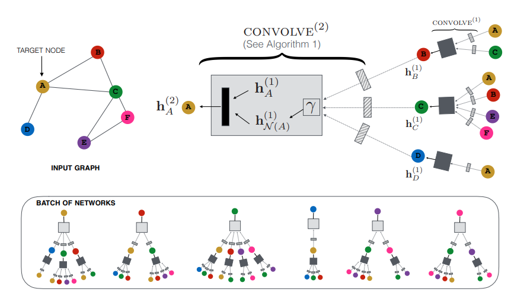
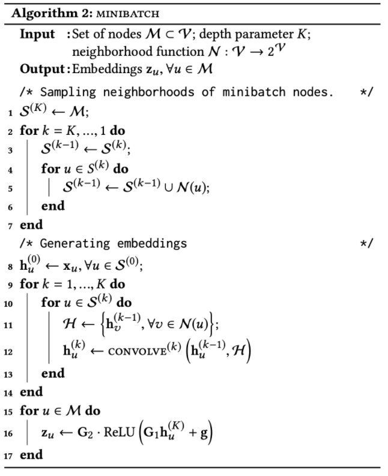
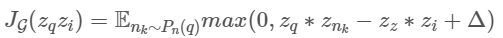
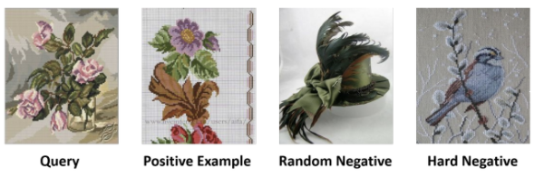
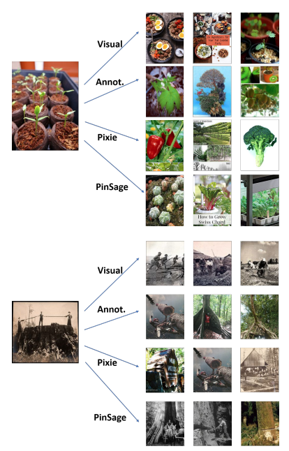

# Graph Convolutional Neural Networks for Web-Scale Recommender Systems
**Reference** : https://greeksharifa.github.io/machine_learning/2021/02/21/Pin-Sage/
PinSAGE는 GraphSAGE를 Pinterest에 추천시스템으로 적용하는 방식이다.  
관계가 포함되는 그래프의 특징을 추천시스템에 활용했다.

PinSAGE는 사람과 아이템의 관계가 아니라 아이템간의 관계를 통해 추천한다는 개념의 모델이다.  
  
## Introduction
- GNN을 통한 추천 시스템은 좋은 성능을 보이고 있으나, 아직 매우 많은 수의 노드와 엣지에 대해서는 실제로 쓰일 수준은 아니다.  
- Random-Walk 기반의 GCN을 일반적인 경우보다 훨씬 큰 규모의 그래프 데이터셋에 적용했다.  
- Metapath : Pin-Board-Pin의 연결에 의미적 정보를 부여한다.  
- Pin 구성시 Image+text+link 정보가 들어간다.  (text는 word2vec으로 가져온다)
- PinSAGE는 Board node의 정보는 사용하지 않는다.  
- PinSAGE는 두 가지 측면에서 기존의 GCN 기반 모델들에 비해 향상되었다.     

  - **Fundamental advancements in scalability**  
      
    1. **On-the-fly convolutions**  
    전체 그래프에 대해서 Laplacian 계산을 하는 전통적인 GCN 알고리즘과 달리, PinSAGE는 노드 주변 이웃들의 정보를 sampling하고 이에 합성곱을 적용했다.  
    2. **Producer-consumer minibatch construction**  
    효과적인 Gradient 계산을 위해서 미리 정의된 그래프를 Tensorflow 모델에 탑재하고 GPU를 최대한 활용하여 미니배치 구조로 학습했다. 
    3. **Efficient MapReduce inference**  
    임베딩 노드 추출과정에서 분산 처리를 수행하여 효율적인 계산이 이루어질 수 있게 했다.

  - **New training techniques and algorithmic innovation**    
  
    1. **Constructing convolution via random walks**  
    랜덤 샘플링이 아닌 Random walks를 활용해서 이웃노드들을 샘플링했다.  
    2. **Importance pooling**  
    Random walks 유사도 측정에 기반한 node feature 집계 방법을 이용하여 성능은 향상했다.  
    3. **Curriculum training**  
    학습 과정에서 알고리즘에 점점 더 어려운 예시들을 추가하는 curriculum training scheme을 적용하여 성능을 12% 향상했다.
  
- PinSAGE는 10억개의 board, 20억개에 달하는 pin을 가진 Pinterest의 여러 추천 시스템에 활용되었다.
- Pinterest에서는 시각적인 요소 (사진 등)으로 고객에게 추천을 제공하는데, 이 때 이 추천 하나하나가 Pin 이라는 요소이고, Pin 중 유사한 것들만 모아서 Board를 구성한다.  
  
## Related walks  
- GCN, GraphSAGE, Deepwalk 등에 대한 설명이다.  
- 실제로 GraphSAGE의 저자와 유사하다.  
  
## Method  

  
- PinSAGE의 개념도  
  
### 1. Problem Setup  
- 좋은 추천 시스템이란 각 노드를 올바르게 embedding한 뒤, 가까운 노드와 먼 노드를 판별하여 노드 prediction 또는 노드 classification을 하는 것이다.  
- Embedding을 학습하기 위해 노드들을 Pin I 과 Board C 로 표현한다.  
- Pin과 Board가 명확하게(?) 구분되지 않는다. 즉 일반적인 User-Item 구조는 아니다.  
### 2. Model Architecture  

  
  
- 위의 과정은 각 노드에 대해 임베딩 벡터를 얻는 과정이다.   
- 노드에 대한 임베딩 벡터를 얻기 위해서 노드의 이웃노드들을 활용한다.  
  
- GraphSAGE의 과정과 유사하다.  
  - GraphSAGE에서 이웃노드들의 임베딩벡터와 타겟 노드의 값을 결합하는 방법에는 Concat, Mean, LSTM hidden state 결합 등이 있다. 그중 Concat이 가장 좋은 성능을 보인다.  
  
  - 이웃노드 집합의 노드 feature를 통합하고 dense layer를 거쳐서 최종 출력한다.  
  
**Importance-based Pooling**  
- 일반적인 GCN은, k-hop (보통 k를 2로 많이 설정) 의 이웃을 살펴볼때, 모든 노드를 살펴보게 되지만, PinSAGE는 각 노드에 영향을 많이 미치는 노드를 선별하여 활용한다.  
- Random Walk로 만나는 Node의 횟수를 통해 선별하는 방식을 이용한다. (PPR를 통해서 -> 페이지 이동에 의한 유사도 같은 느낌) 
- 위의 임베딩 벡터를 얻는 과정에서 이 visit count를 가중치로 이용할 수 도 있다. 이를 importance pooling이라고 한다.  
  
**Stacking convolutions**  
- 위의 노드 임베딩 과정(convolve)를 거치고 나면 각 노드의 임베딩 벡터가 나오기 때문에 해당 과정을 stack 하면 이웃정보를 계속해서 얻을 수 있다.  
- 여러 층의 layer를 stack하게 되므로 layer내의 파라미터는 공통으로 쓰이게 되며 layer간에는 독립적이다.  
  

  
  
- 위의 사진은 미니 배치 조건에서 여러 층의 convolution이 일어나는 과정이다.  
  
### 3. Model Training  
- 각 GPU는 미니 배치의 한 부분씩 담당하게 되고 GPU는 모델계산을, CPU는 feature 추출 및 negative sampling 을 맡는다.  
- PinSAGE는 Max-margin Ranking Loss로 학습한다.  
  

   
  
- Triplet loss라고 볼 수 있다.  
- 기준이 되는 점에서 negative한 score는 낮게, positive는 높게끔 설정한다.  
  
- **Positive sample**: Pinterest User Session 데이터를 기준으로 Next Image Click Item을 사용한다. 각 이미지는 pair 이미지 쌍으로 구성된다.  
- **Negative sample**: Query와 Pair item에 포함되지 않는 아이템 500개를 랜덤으로 설정한다. 
  
- Query와 Pos는 유사하게, Neg는 멀어지게 학습한다. 결과가 Margin 값 이상 차이가 나도록 한다.  
- Negative score는 일반적으로 작다. 그 이유는 2억개중에 500개를 뽑으면 대부분 서로 유사하지 않기 때문이다.  
- 따라서 Loss 전파에 도움이 되도록하는 Hard Negative sample을 사용한다.
  

   
  
- **Hard negative**: Query와 관련은 있지만, positive만큼 관련이 있지는 않은 아이템을 선택한다.  
  - Query 기준 PPR에서 ranking 2000-5000 중 랜덤하게 선택한다.  
  
- 처음부터 어렵게 주면 학습이 잘 안되므로 처음에는 Negative sample만 주고, epoch이 진행하면서 Hard negative를 하나씩 늘려간다.  
- 이를 통해 점진적으로 positive와의 세부적 차이를 학습한다.  
  
## Case Study  
  

  
  
- Vision은 질감과 색감 등이 비슷한 이미지를 찾기 때문에 의미적인 부분이 다를 수 있다.  
- Annot은 의미론적으로 비슷한 이미지를 찾지만, 이미지 특징이 반영되지 않는다. 
- Pixie는 PPR을 통해서 Ranking retrieval, 즉 그래프 구조 정보로 추천한다. 무난한 추천이다.  
- PinSAGE는 시각적 정보와 의미론적 정보를 함께 사용하여 이미지와 유사한 아이템을 추천한다.  
